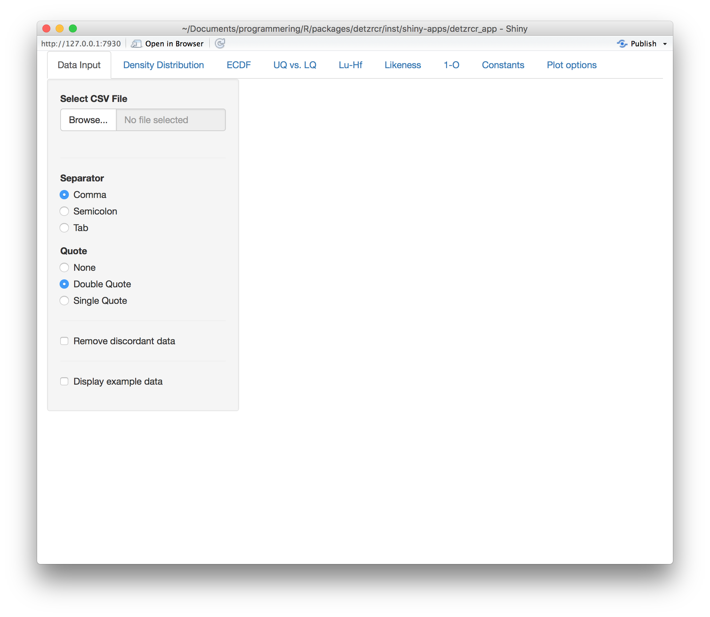
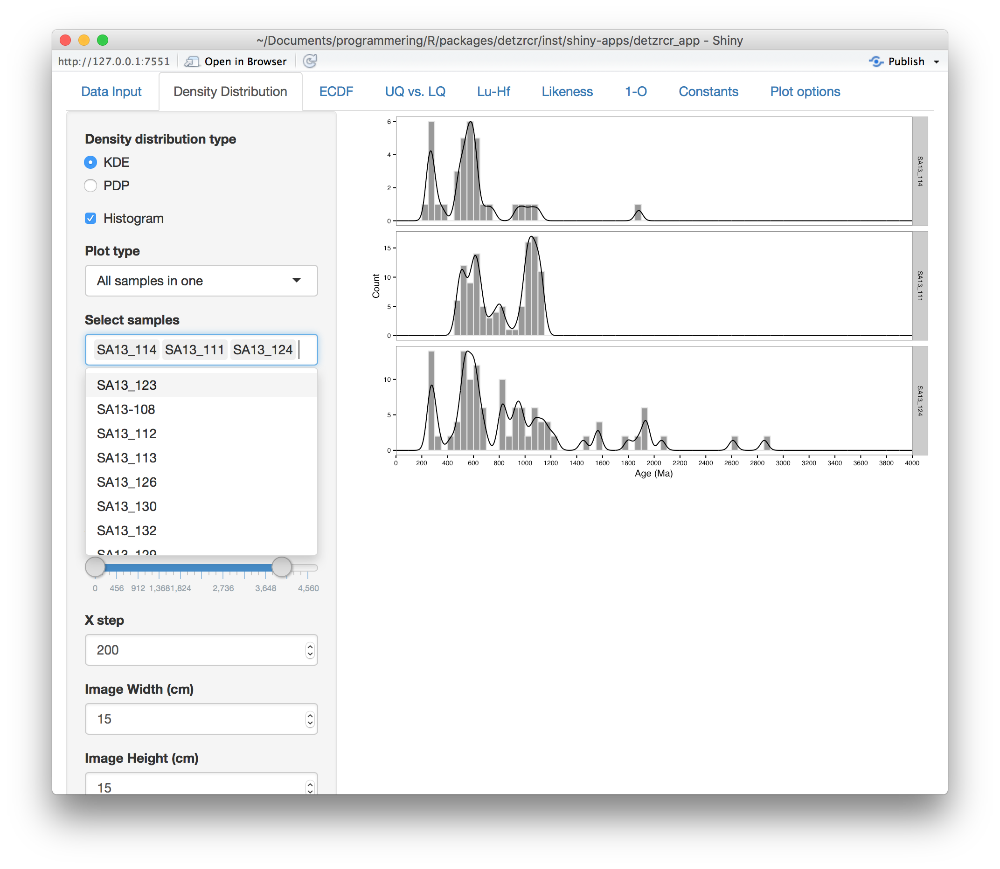
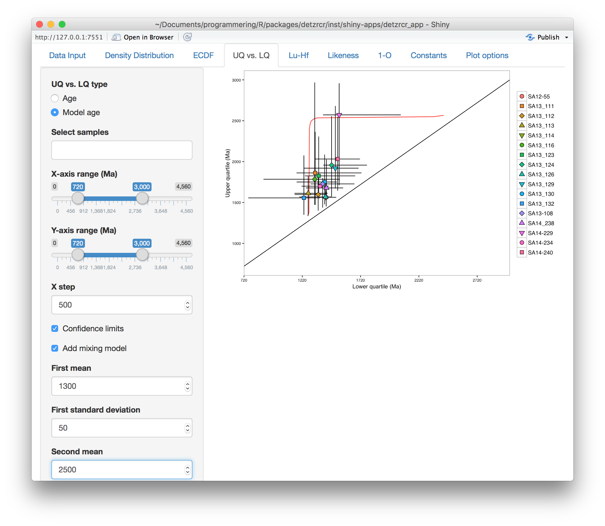
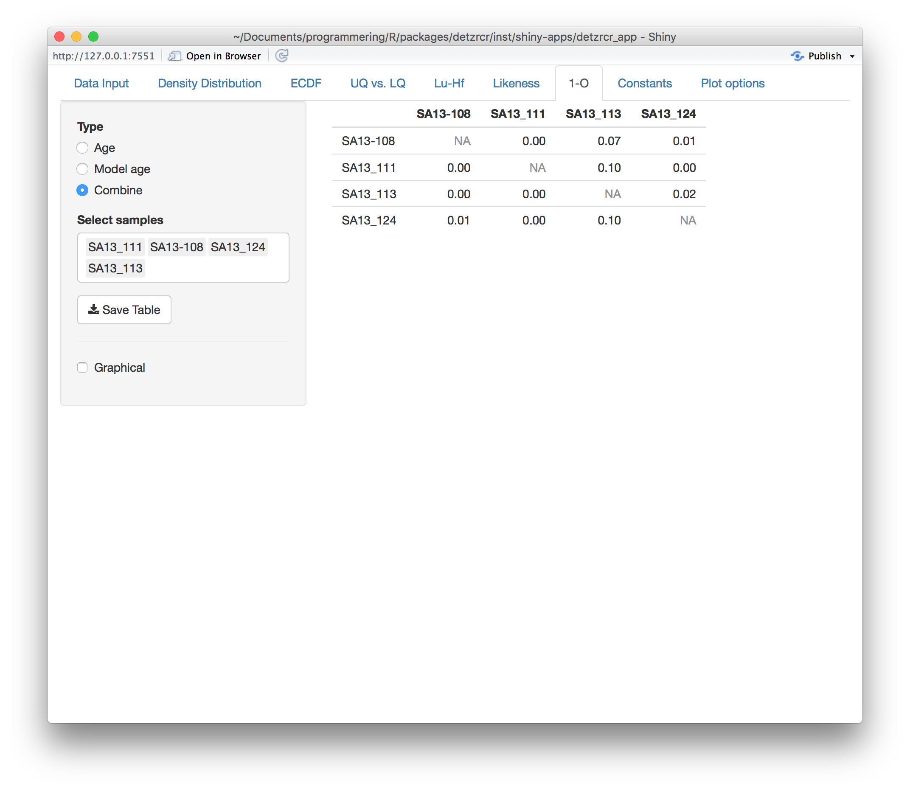
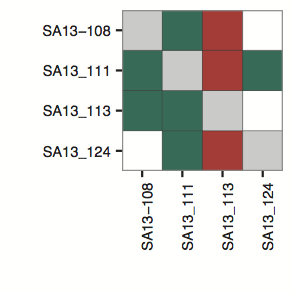

## Installing and running the package

The latest version of [R](https://r-project.org) must be installed and
[Rstudio](https://rstudio.com) is recommended.
The released version of the package can be installed from
[CRAN](https://CRAN.R-project.org/package=detzrcr)

```{r, eval=FALSE}
install.packages("detzrcr")
```
or the development version can be installed from 
[github](https://github.com/magnuskristoffersen/detzrcr) (requires `devtools`)

```{r, eval=FALSE}
# install.packages("devtools")
devtools::install_github(magnuskristoffersen/detzrcr)
```

Launch the user interface with
```{r, eval=FALSE}
library("detzrcr")
run_detzrcr()
```

## Required input format

The data must be input in a csv-file which is uploaded to the `Data input` tab
(Fig. 1) in the *shiny* interface. 



This file has certain requirements

* Each row contains one analysis
* Contains columns with headers **sample** and **age**
* Discordancy and uncertainty of the age data, if included, in columns with
headers **disc** and **uncert**, respectively
* Discordancy is percentage discordance where 0 signifies concordance, a
negative value normal and a positive value reverse discordance
* Uncertainty is the $1\sigma$ absolute uncertainty of the age
* Hf data as measured $^{176}$Hf/$^{177}$Hf and measured $^{176}$Lu/$^{177}$Hf
in columns **hfhf** and **luhf**, respectively or as initial $\epsilon$Hf in
column **ehf_i**
* Data in Hf columns can be left empty
* It is recommended to include an identifier for the analysis, there is no
required name for this column but it can be **point**, **analysis** etc.

```{r, echo=FALSE, results='asis'}
dat <- read.csv('karoo.csv')
knitr::kable(head(dat, 5), format='pandoc', caption='Example input format')
```

## Features

* Plot age data as KDEs and PDPs
* Plot age and Hf model age as ECDFs
    + Add confidence bands
* Plot age and Hf model age in upper quantile vs. lower quantile space
    + Add confidence limits
    + Add Gaussian mixture model
* Plot Hf data as initial $\epsilon$Hf vs. age or initial $^{176}$Hf/$^{177}$Hf
vs. age
    + Add sample contours
* Export publication quality figures (as pdf)
* Calculate similarity measures
    + Satkoski likeness (Satkoski et al. 2013)
    + 1-O (Andersen et al. 2016a)
* Export similarity and Hf tables as csv files

## Usage
`detzrcr` has been designed to be easy to use with no prior knowledge of
`R` required. We therefore chose to build the package as a `shiny` 
based user interface where the user can simply upload a data file and output
publication quality figures (using `ggplot2`) and tables.

Data is uploaded in the `Data input` tab (Fig. \ref{fig1}). From this tab a
concordance filter can be applied to the data (defaults to $\pm$ 10%). The
different featuresof the R-package can then be used by selecting the appropriate
panel tab in the user interface. By selecting the `Density distribution` tab the
user can plot the U-Pb age data as KDEs (user selectable fixed bandwidth) or
PDPs (local variable bandwidth based on the absolute $1\sigma$ uncertainty).
Which samples to plot and in what order can be selected from the `Select sample`
menu (Fig. fig2). This feature is also available for all other plot and table
options.



ECDFs of U-Pb age data as well as Hf model age data can be plotted from the
`ECDF` tab, 95% confidence bands calculated using the Dvoretzky-Kiefer-Wolfowitz
(DKW) inequality (Dvoretzky et al. 1956) can be added.
In the `UQ vs. LQ` tab U-Pb age data and Hf model age data is plotted in UQ vs.
LQ space where (95% DWK) confidence limits and a gaussian mixture model can be
added (Fig. 3).



Hf data can be plotted from the `Lu-Hf` tab as initial $\epsilon$Hf vs. age or
initial $^{176}$Hf/$^{177}$Hf vs. age, where sample contours can be added.
The implemented similarity measures are found in the `Likeness` and `1-O` tabs
where the likeness (Satkoski et al. 2013) and 1-O (Andersen et al. 2016a)
parameters are calculated and displayed. Likeness can be calculated in both 1
dimension (U-Pb age only) and 2 dimensions (U-Pb age and initial $\epsilon$Hf).
1-O can be calculated for U-Pb age and Hf model age. In each of these panels the
two options can be combined into one table with U-Pb data in the upper triangle
and Hf data in the lower triangle (Fig. 4). All tables can be saved to
csv-files.



The 1-O table can also be displayed graphically (Fig. 5) where red indicates
$1-O \geq 0.05$, white $0 < 1-O < 0.05$ and green $1-O = 0$.



Constants used in Hf calculations can be changed in the `Constants` tab.
Default values are as follows

* $\lambda ^{176}Lu = 1.867 \times 10^{-11} a^{-1}$ (Söderlund et al. 2004) 
* CHUR values: $^{176}$Lu/$^{177}$Hf$=0.0336$, $^{176}$Hf/$^{177}$Hf$=0.282785$
(Bouvier et al. 2008)
* Depleted mantle values: $^{176}$Lu/$^{177}$Hf$=0.0388$,
$^{176}$Hf/$^{177}$Hf$=0.28325$ (from Griffin et al. (2004) modified to 
the aforementioned decay constant and CHUR values)
* $^{176}$Lu/$^{177}$Hf value used in two step depleted model age $=0.015$

## Reimink intercepts

The method of Reimink et al. (2016) to find the most likely time of lead loss in
suites of discordant detrital zircon is added to the package. To use this
feature the input data must include $^{207}Pb/^{235}U$, $1\sigma$ absolute
error of $^{207}Pb/^{235}U$, $^{206}Pb/^{238}U$, $1\sigma$ absolute error of
$^{206}Pb/^{238}U$, and error correlation with the column names r75, sigma75,
r68, sigma68 and rho, respectively.

### Data source
All data shown herein are taken from Andersen et al. (2016b).

### References
Andersen, T., Elburg, M., Cawthorn-Blazeby, A., 2016a. U–Pb and Lu–Hf zircon data
in young sediments reflect sedimentary recycling in eastern South Africa. J.
Geol. Soc. London. 173, 337–351. https://dx.doi.org/10.1144/jgs2015-006

Andersen, T., Kristoffersen, M., Elburg, M.A., 2016b. How far can we trust
provenance and crustal evolution information from detrital zircons? A south
African case study. Gondwana Research 34, 129–148.
https://doi.org/10.1016/j.gr.2016.03.003

Bouvier, A., Vervoort, J.D., Patchett, P.J., 2008. The Lu-Hf and Sm-Nd isotopic
composition of CHUR: Constraints from unequilibrated chondrites and implications
for the bulk composition of terrestrial planets. Earth Planet. Sci. Lett. 273,
48–57. https://dx.doi.org/10.1016/j.epsl.2008.06.010

Dvoretzky, A., Kiefer, J., Wolfowitz, J., 1956. Asymptotic Minimax Character of
the Sample Distribution Function and of the Classical Multinomial Estimator.
Ann. Math. Stat. 27, 642–669. https://dx.doi.org/10.1214/aoms/1177728174

Griffin, W.L., Belousova, E.A., Shee, S.R., Pearson, N.J., O’Reilly, S.Y., 2004.
Archean crustal evolution in the northern Yilgam Craton: U-Pb and Hf-isotope
evidence from detrital zircons. Precambrian Res. 131, 231–282.

Reimink, J. R., Davies, J. H. F. L., Waldron, J. W. F., & Rojas, X. (2016).
Dealing with discordance: a novel approach for analysing U-Pb detrital zircon
datasets. Journal of the Geological Society, 2015-114.
https://doi.org/10.1144/jgs2015-114

Satkoski, A.M., Wilkinson, B.H., Hietpas, J., Samson, S.D., 2013. Likeness among
detrital zircon populations — An approach to the comparison of age frequency
data in time and space. GSA Bull. 125, 1783–1799.
https://dx.doi.org/10.1130/B30888.1

Söderlund, U., Patchett, P.J., Vervoort, J.D., Isachsen, C.E., 2004. The 176Lu
decay constant determined by Lu-Hf and U-Pb isotope systematics of Precambrian
mafic intrusions. Earth Planet. Sci. Lett. 219, 311–324.
https://dx.doi.org/10.1016/S0012-821X(04)00012-3
